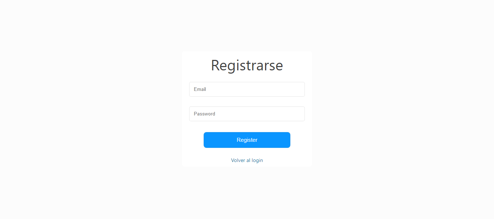
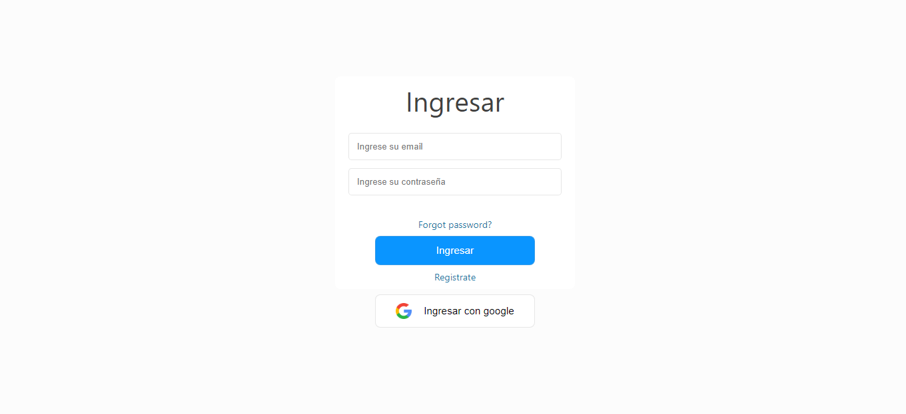
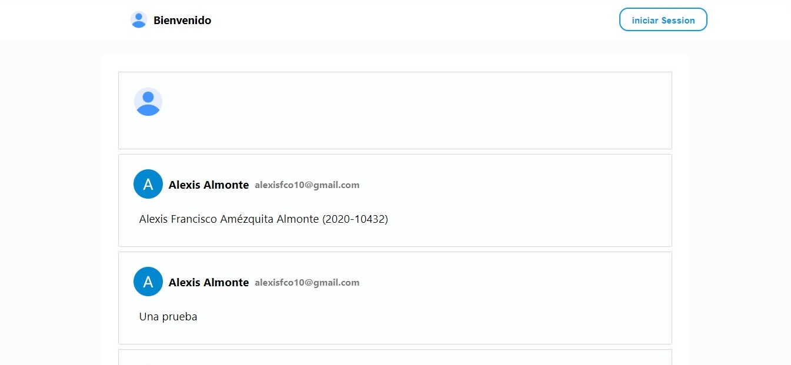

## Correr proyecto

##### `npm install`
##### `npm start`
# Funcionamiento
### Registrarse
 `http://localhost:3000/register`

### Loguearse
 `http://localhost:3000/login`

Aquí puede recuperar su contraseña en caso de haberla olvidado
`http://localhost:3000/recoverpassword`

Aquí se pueden ver las publicaciones realizadas por los diferentes usuarios
`http://localhost:3000/`

